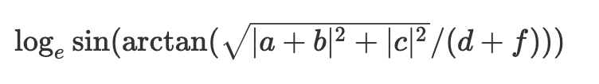
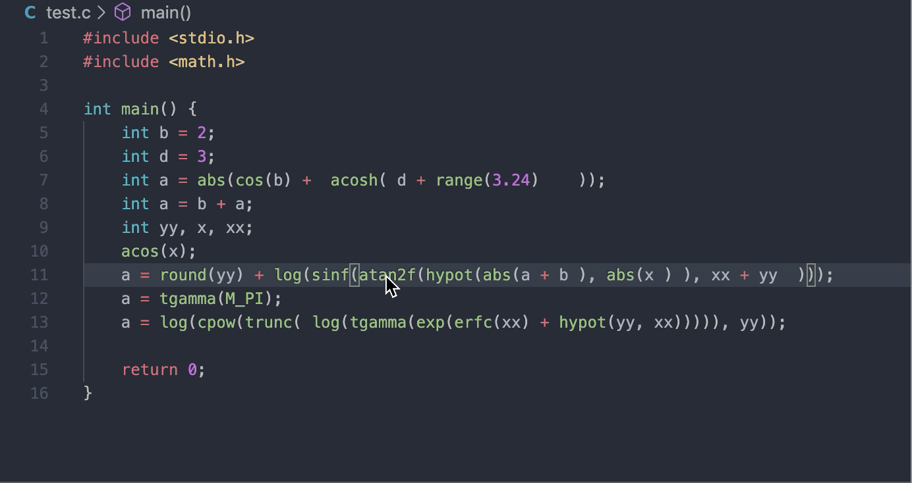

# C/C++ math formula viewer


## Motivation

We can utilize useful mathematical functions in C/C++ by including `math.h` or `cmath` library. However, it is hard to recognize the full functionality of the function at a glance if the function call is deep and complex. The indirect function signature also reduces cognition.  For example, it is hard to know the mathematical meaning of the following code:
```c
log(sinf(atan2f(hypot(abs(a + b), abs(c)), d + f)).
``` 
This is inefficient!!
It will be better to show the functionality with common math formula form:



Therefore, I implemented the plugin in which the users can directly see the following formula, driven by the overlapped math function.

## Features

#### Hovering math formula



Quite intuitive. 
First, write the c or c++ code with the functions & constants from c math libraries. And if you point the math function with the mouse, the plugin parses the function and its arguments recursively and hovers the generated Unicode-style math formula. 

#### Supporting cmath function

##### Absolute
`abs` `labs` `llabs` `fabs` `fabsf` `fabsl` `cabs` `cabsf` `cabsl` 
##### Exponential
`exp` `expf` `expl` `exp2` `exp2f` `exp2l` `expm1` `expm1f` `expm1l`
`ldexp` `ldexpf` `ldexpl`
##### Logarithm
`log` `logf` `logl` `log2` `log2f` `log2l` `log10` `log10f` `log10l`
`log1p` `log1pf` `log1pl`
##### Nearest Integer
`ceil` `ceilf` `ceill` `floor` `floorf` `floorl` `trunc` `truncf` `truncl`
`round` `roundf` `roundl` `lround` `lroundf` `lroundl` `llround` `llroundf` `llroundl` 
##### Power
`sqrt` `sqrtf` `sqrtl` `cbrt` `cbrtf` `cbrtl`
##### Hypotenues
`hypot` `hypotf` `hypotl`
##### Trigonometric
`sin` `sinf` `sinl` `cos` `cosf` `cosl` `tan` `tanf` `tanl`
`asin` `asinf` `asinl` `acos` `acosf` `acosl` `atan` `atanf` `atanl`
`sinh` `sinhf` `sinhl` `cosh` `coshf` `coshl` `tanh` `tanhf` `tanhl`
`csinh` `csinhf` `csinhl` `ccosh` `ccoshf` `ccoshl` `ctanh` `ctanhf` `ctanhl`
`asinh` `asinhf` `asinhl` `acosh` `acoshf` `acoshl` `atanh` `atanhf` `atanhl`
`casinh` `casinhf` `casinhl` `cacosh` `cacoshf` `cacoshl` `catanh` `catanhf` `catanhl`
`atan2` `atan2f` `atan2l`
##### Error
`erf` `erff` `erfl` `erfc` `erfcf` `erfcl`
##### Gamma
`tgamma` `tgammaf` `tgammal` `lgamma` `lgammaf` `lgammal`


## Release Notes


### 1.0.0

Initial release of the plugin
Hovers generated math formula when the user points certain math function

### 1.0.4

Real Ready for the release 
(cleanup code, add logo, eliminate unneccesary functionalities)


## Future plan

- viewing latex style formula
- Support more language (java, python...)

----------------------------------------------------------------------------

<!--
## Requirements

If you have any requirements or dependencies, add a section describing those and how to install and configure them.

## Extension Settings

Include if your extension adds any VS Code settings through the `contributes.configuration` extension point.

For example:

This extension contributes the following settings:

* `myExtension.enable`: enable/disable this extension
* `myExtension.thing`: set to `blah` to do something
*/

-->
